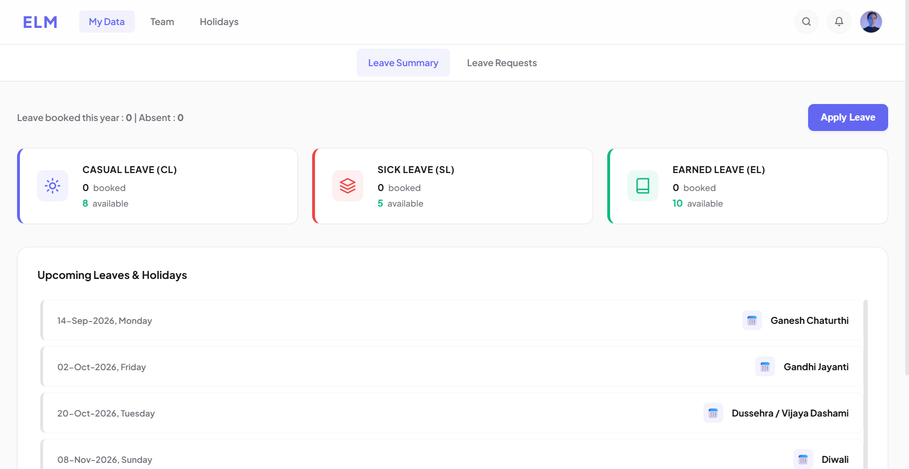
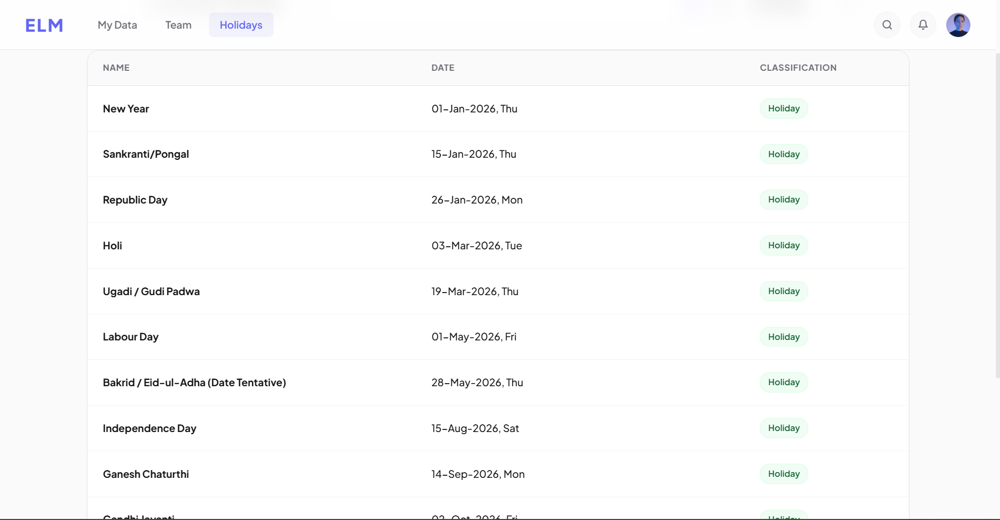

# ELM — Employee Leave Management System

A web application designed to streamline the request, approval, and tracking of employee leaves. This project is built using a **Vanilla HTML/CSS/JS frontend** and a **Spring Boot REST API backend** connected to a **MySQL database**.

---

## 🏗️ System Architecture & Workflow

ELM is structured into three main layers:

```
┌─────────────────┐         REST API (JSON)         ┌─────────────────┐
│    FRONTEND     │ ◄─────────────────────────────► │    BACKEND      │
│  (Port 3000)    │                                 │  (Port 8081)    │
│                 │                                 │                 │
│ HTML/CSS/JS     │                                 │ Spring Boot REST│
│ served locally  │                                 │ Hibernate / JPA │
└─────────────────┘                                 └────────┬────────┘
                                                             │
                                                             │ SQL
                                                             ▼
                                                    ┌─────────────────┐
                                                    │    DATABASE     │
                                                    │  MySQL (3306)   │
                                                    └─────────────────┘
```

### Key Workflows:
1. **Authentication**: Users log in on the login page. A `POST` request to the authentication endpoint checks the database and generates a signed JWT (JSON Web Token) on success. The client saves this token and automatically injects it into the standard `Authorization: Bearer <token>` header for all subsequent API requests to secure sessions dynamically.
2. **Leave Request**: Employees fill out the request on the leave form. The page dynamically displays the calculated leave days before submission. On submission, the backend checks for overlapping dates and registers the request as `PENDING`.
3. **Manager Actions**: Managers see all employee requests in their dashboard view. They can approve or reject the requests directly. Employees can cancel their requests from their dashboard. Leave balances are recalculated automatically.

### 🛡️ Edge Cases Covered:
1. **Weekend Exclusion**: If an employee takes leave starting Friday and ending Monday, the system automatically excludes Saturday and Sunday. The calculated total leave days is **2**.
2. **Holiday Exclusion**: If an employee takes leave from Wednesday to Friday, and Thursday is a public holiday, the holiday is excluded from the count. The calculated total leave days is **2**.
3. **Overlapping Leaves**: The system blocks any overlapping leave requests (Pending or Approved) for the same employee, throwing a validation error on submission.
4. **Status Guards**: An already approved leave cannot be rejected, and a rejected leave cannot be cancelled.
5. **Account Creation & Security**: Employees cannot create accounts themselves. Only an Admin or Manager can create employee accounts via the directory. Employees can then log in and edit their profiles (including changing passwords) to prevent unauthorized access.

---

## 👥 Features by Role

### Employees
* View leave balances (Casual, Sick, and Earned leaves) and request histories.
* Submit new leave requests with a reason.
* Cancel pending or approved leave requests.
* View a weekly calendar schedule showing which team members are out of office.

### Managers
* Full directory access to create, edit, or delete employee profiles.
* Approve or reject pending leave requests.
* View dynamic admin reports (Total leaves taken per employee, staff with zero leaves, and leave type popularity).

---

## 📸 Application Screenshots

Here is the visual walkthrough of the application in sequence:

### 1. User Authentication & Profile
| Login Screen | User Dashboard |
|---|---|
|  *The login page where users enter their email and password to log in. Note: Employees cannot create accounts. Only an Admin or Manager can create accounts, and then the employee can change their password to prevent unauthorized registrations.* |  *The home page showing leave balances like Casual, Sick, and Earned leaves.* |

| Edit Profile | Public Holidays List |
|---|---|
|  *The profile page where employees can update their personal details.* |  *The holidays page displaying the list of public holidays.* |

### 2. Leave Application & History
| Leave Apply Form | Apply for Leave |
|---|---|
|  *The pop-up form where employees fill in leave dates and details.* |  *The page where employees start applying for leave.* |

| Leave History List |
|---|
|  *The page showing all leave requests submitted by the user and their current status (showing 'PENDING' before a manager accepts it).* |

### 3. Team Calendar & Schedule
| Weekly Absences Grid |
|---|
|  *The calendar page showing which employees are on leave each day of the week.* |

### 4. Administrative & Manager Panel
| Add Employee Dialog |
|---|
|  *The form used by managers to add new employee accounts.* |

| Pending Requests Grid (Full Width View) |
|---|
|  <br> *The admin page where managers see all pending leave requests.* |

| Approval Actions | Recalculated Balances |
|---|---|
|  *The admin page showing the updated requests list after a manager approves or rejects requests.* |  *The employee's dashboard showing updated leave counts after the manager approved the request.* |

### 5. Backend Database & API Testing
| MySQL Users Table | MySQL Leave Requests Table |
|---|---|
|  *The `employee` table inside MySQL showing registered accounts.* |  *The `leave_request` table inside MySQL showing requested leaves.* |

| Postman Endpoints Suite |
|---|
|  *Testing and verifying the backend REST APIs inside Postman.* |

---

## 🗄️ Database Schema

The database consists of 3 relational tables:

```
                  ┌──────────────────┐
                  │    EMPLOYEE      │
                  ├──────────────────┤
                  │ id (PK)          │◄────────┐
                  │ employee_id      │         │
                  │ first_name       │         │
                  │ last_name        │         │
                  │ email (UQ)       │         │
                  │ password         │         │
                  │ department       │         │
                  │ role             │         │
                  └──────────────────┘         │
                                               │ Foreign Key
                  ┌──────────────────┐         │ (employee_id)
                  │  LEAVE_REQUEST   │         │
                  ├──────────────────┤         │
                  │ id (PK)          │         │
                  │ employee_id (FK) ├─────────┘
                  │ leave_type       │
                  │ start_date       │
                  │ end_date         │
                  │ number_of_days   │
                  │ status           │
                  │ reason           │
                  └──────────────────┘

                  ┌──────────────────┐
                  │     HOLIDAY      │
                  ├──────────────────┤
                  │ id (PK)          │
                  │ name             │
                  │ holiday_date (UQ)│
                  │ description      │
                  └──────────────────┘
```

* **Note**: We separate `id` (database auto-increment join key) from `employee_id` (the public staff code, e.g. `E101`). This ensures business staff codes can be modified in the future without breaking historical relational records.

---

## 📁 Folder Structure

```
LM/
├── backend/                  ← Spring Boot application folder
│   ├── src/main/java/        ← Java source files (Controllers, Services, Entities)
│   ├── src/main/resources/   ← Config properties, schema.sql, data.sql
│   └── pom.xml               ← Maven dependencies
├── database/                 ← Seed SQL files
└── frontend/                 ← User Interface static files
    ├── index.html            ← Main dashboard
    ├── pages/                ← Sub-pages (login, employees, holidays, etc.)
    ├── js/                   ← JS controllers (api.js, common.js, etc.)
    └── css/                  ← CSS style sheets
```

---

## 🚀 Getting Started

### 1. Setup the Database
Ensure you have a local MySQL server running on port `3306` and create a database named `leave_management`.
On startup, Spring Boot will automatically run the schema and seed data found in the `backend/src/main/resources/data.sql` and `schema.sql` files.

### 2. Start the Spring Boot Backend
Configure your MySQL credentials in `backend/src/main/resources/application.properties` and run:
```bash
cd backend
.\apache-maven-3.9.6\bin\mvn.cmd spring-boot:run
```
* API Server URL: `http://localhost:8081`

### 3. Start the Frontend
Run a local static server to open the files correctly in your browser:
```bash
cd frontend
python -m http.server 3000
```
Open `http://localhost:3000` in your web browser.

### 4. Default Credentials (Test Accounts)
| Role | Email | Password |
|---|---|---|
| **Manager** | `manager@gmail.com` | `Pass@123` |
| **Employee** | `shailesh@gmail.com` | `Pass@123` |

---

## 🧪 Running Tests

To run the JUnit unit tests validating the service logic, run:
```bash
cd backend
.\apache-maven-3.9.6\bin\mvn.cmd test
```
All repository queries are mocked using Mockito, ensuring tests run instantly without database dependencies.
