# BookBasket - Smart Online Book Rental & Library Operations Platform

---

## Problem Statement

Build a full-stack Book Management and Library Operations Platform using Java, Spring Boot, Spring Data JPA, SQL, HTML5, Vanilla CSS3, and JavaScript.

The platform manages books, authors, categories, borrowers, reviews, and loan transactions. Users can register as readers to browse the catalog, borrow books, read digital previews, set bookmarks, and leave star reviews. Any user can also register as an Author to publish and contribute new books to the library, expanding the catalog and updating the author count in the database.

The system strictly enforces business rules for inventory consistency (a book cannot be borrowed when available copies reach zero, borrowing decrements stock, returning restores stock), validates input fields, and provides structured REST APIs, relational database schema, automated tests, and a responsive web interface.

---

## Table of Contents
1. [Problem Statement](#problem-statement)
2. [Technology Stack](#technology-stack)
3. [User Authentication & Author Registration Flow](#user-authentication--author-registration-flow)
4. [Frontend Architecture & User Interface](#frontend-architecture--user-interface)
5. [Backend Engineering & Architecture](#backend-engineering--architecture)
6. [Mandatory REST API Specifications](#mandatory-rest-api-specifications)
7. [Business Rules & Validation Logic](#business-rules--validation-logic)
8. [Database Design & Live SQL Query Results](#database-design--live-sql-query-results)
9. [Download, Setup & Run Guide](#download-setup--run-guide)
10. [Testing & Quality Assurance](#testing--quality-assurance)
11. [Project Structure](#project-structure)

---

## Technology Stack

| Layer | Technologies Used |
| :--- | :--- |
| **Frontend** | HTML5, Modern Vanilla CSS3 (CSS Variables, Glassmorphism, Responsive Grid), JavaScript (ES6+ Single Page Application) |
| **Typography** | Google Fonts (Outfit, Playfair Display) |
| **Backend Framework** | Java 17+, Spring Boot 3.3.x, Spring Web (RESTful API) |
| **ORM & Data Access** | Spring Data JPA, Hibernate 6.x |
| **Database** | H2 In-Memory Relational Database (zero-configuration default) / PostgreSQL / MySQL |
| **Testing Suite** | JUnit 5, MockMvc, AssertJ, Spring Boot Test (64 automated tests) |
| **Build & Tooling** | Apache Maven, Git |

---

## User Authentication & Author Registration Flow

The platform enforces strict role differentiation between general readers and registered authors:

### 1. Guest View & Reader Authentication
* Visitors can freely browse the catalog, but must log in to borrow books, read digital copies, save bookmarks, or manage their personal shelf.
* The top navigation bar displays clear **Become an Author** and **Login** buttons for unauthenticated visitors.

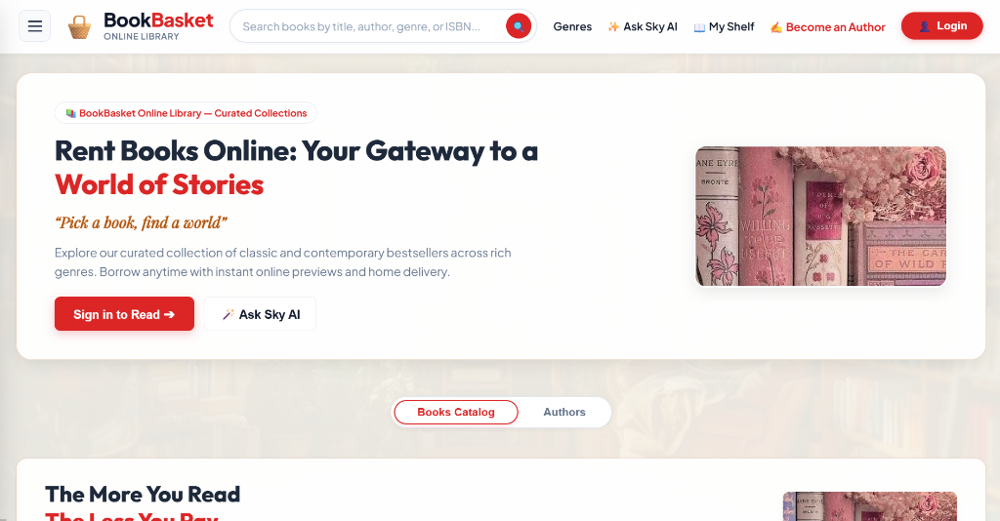

* Clicking **Login** opens the authentication modal supporting Email/Password and Google sign-in (`POST /api/auth/login`, `POST /api/auth/signup`).

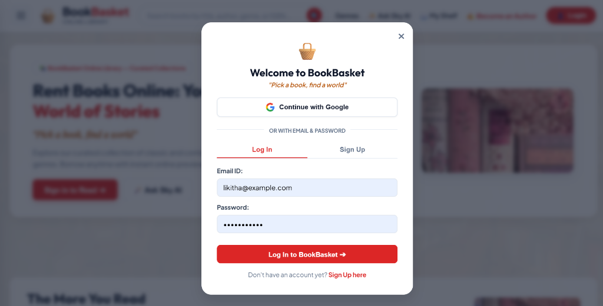

---

### 2. Author Registration & Publishing Privileges
* Any user can register as an author via the sidebar drawer, profile menu, or authors view.
* Submitting the registration form invokes `POST /api/authors`, creating a new author record in the database and increasing the total author count.
* Once registered, the user's profile updates to **Verified Author**, unlocking the **+ Publish Book** button across the top navigation bar and sidebar drawer.

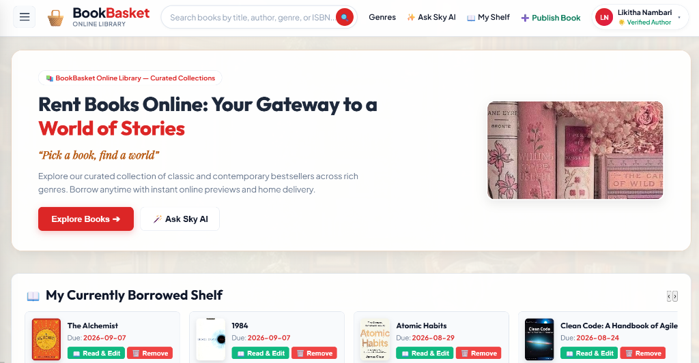
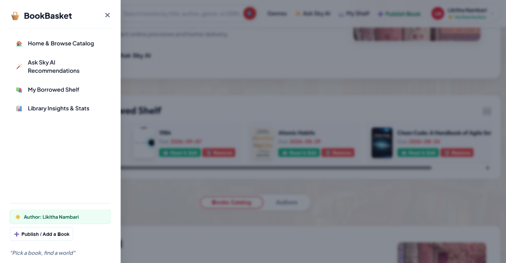

---

### 3. Book Publishing by Registered Authors
* When a verified author clicks **+ Publish Book**, the book creation form opens with their author profile automatically pre-selected.
* Submitting the book form calls `POST /api/books`, persisting the new book in the catalog and linking it directly to the author in the database.

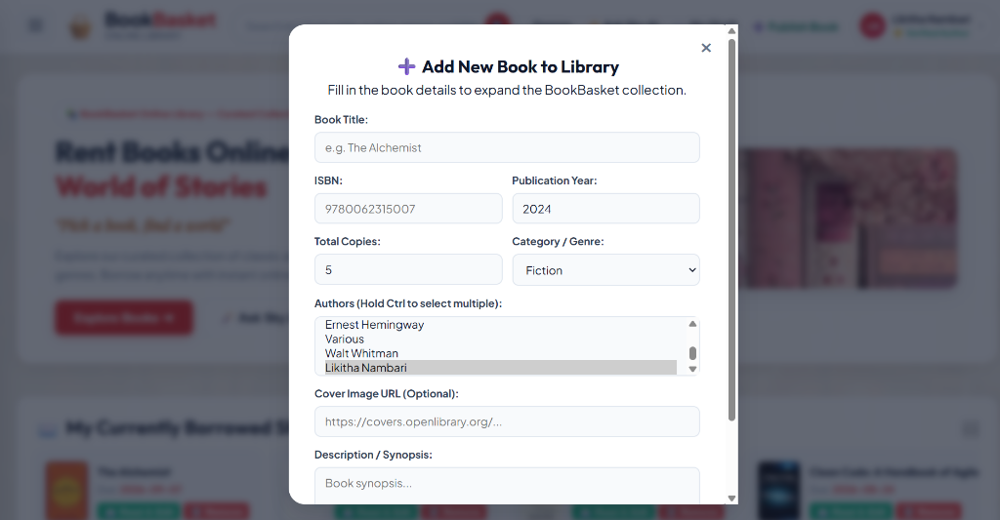

---

## Frontend Architecture & User Interface

The user interface is built as a Single Page Application (SPA) with responsive layouts, smooth transitions, and dedicated reader utilities.

### 1. 20 Curated Genres and Books Catalog
* Horizontal scrollable genre track featuring 20 curated categories (Fiction, Mystery, Thriller, Romance, Fantasy, Sci-Fi, Horror, Historical, Adventure, Biography, Autobiography, Self-Help, Psychology, Philosophy, Business, Technology, Young Adult, Children's Literature, Poetry, Classics).
* **Live Inventory Indicators**: Real-time stock status (Available copies count or Out of Stock indicator).
* **Action Buttons**: Direct controls for Borrow, View Details, and Read.

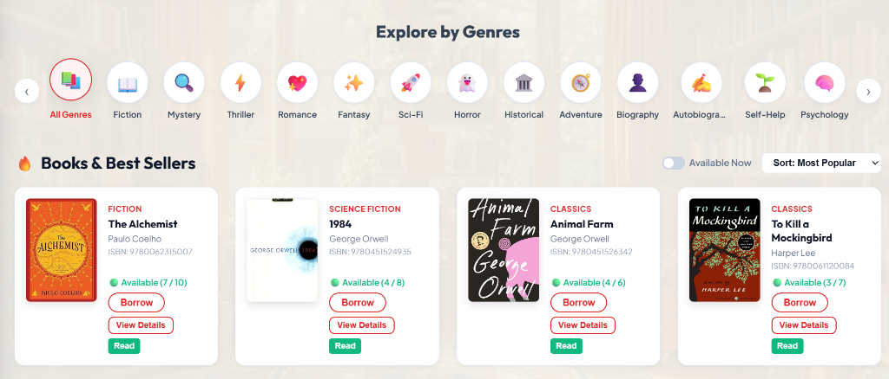

---

### 2. Dedicated Book Details Modal and Community Reviews
* **Book Overview**: Title, Author, Genre, ISBN, Publication Year, Description, and Availability.
* **Community Rating**: Real-time average star rating calculated from reader submissions.
* **Leave a Review Form**: Interactive 1 to 5 star rating selector, reviewer handle, and review comments (`POST /api/books/{id}/reviews`).

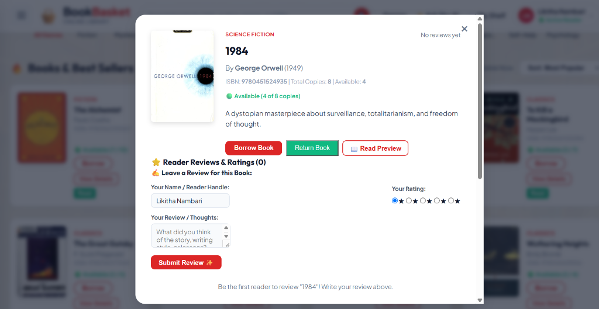

---

### 3. Borrowing History and Co-Borrowing Recommendations
* **Borrowing History Table**: Real-time record of all past and active borrowers for each individual book.
* **Smart Affinity Recommendations**: Displays frequently co-borrowed companion books based on library borrow patterns.

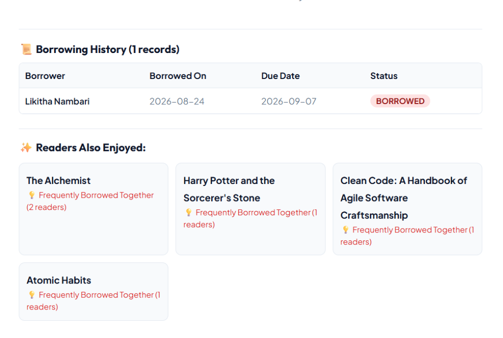

---

### 4. My Reading Shelf and Active Loan Management
* **Reading Shelf & History Table**: Detailed list of active and returned loans with status indicators (BORROWED, RETURNED, OVERDUE) and due dates.
* **Active Shelf Carousel**: Horizontal view of currently borrowed books directly on the home page.
* **Shelf Actions**: Options to Read & Edit or Return and remove books from the personal shelf.

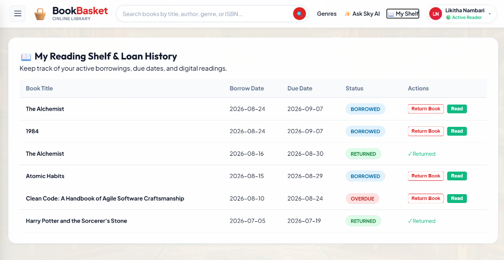
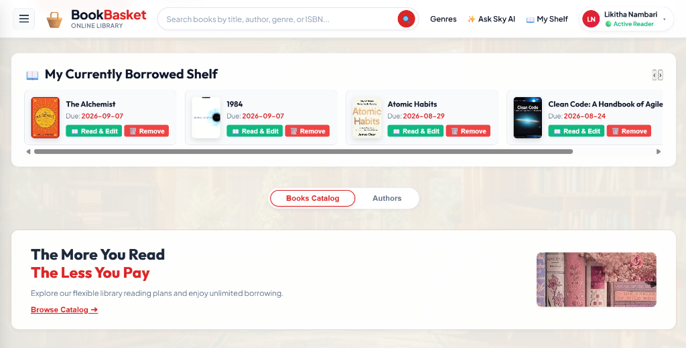

---

### 5. Sky AI - Smart Book Recommender
* Natural-language conversational recommendation assistant.
* Users can input themes, moods, or topics (e.g., "I want a thriller book" or "Inspiring books on mindset").
* Generates instant personalized picks with direct borrow buttons (`POST /api/recommendations/sky`).

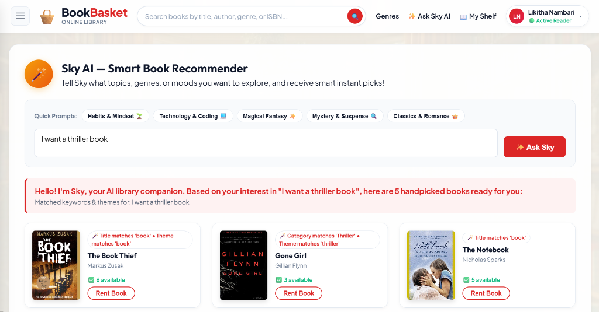

---

### 6. Interactive Online Reader (Bookmarks, Highlights & Notes)
When opening a book via the Read button:
* **Bookmark Position**: Save chapter and page progress (e.g., Chapter 2 - Page 30). Automatically syncs to the personal shelf.
* **Highlights & Key Points**: Save memorable quotes and key lessons while reading.
* **Personal Notes**: Write personal reading reflections per book.

---

### 7. Library Insights & Analytics Dashboard
* **Live KPI Overview Cards**: Real-time metric cards tracking Total Titles, Available Copies, Currently Borrowed Books, and Registered Readers (`GET /api/dashboard`).
* **Most Borrowed Books Leaderboard**: Ranked leaderboard of most popular titles with checkout volumes (`GET /api/analytics/most-borrowed`).
* **Category Share Distribution**: Dynamic progress bars displaying inventory percentage shares across genres (`GET /api/analytics/category-stats`).

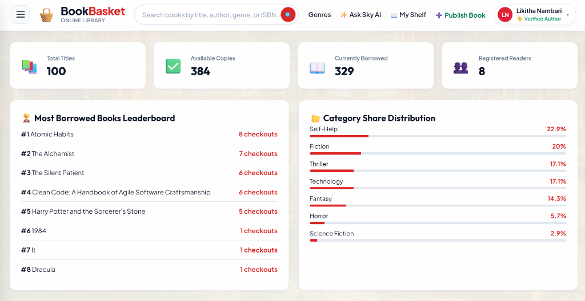

---

## Backend Engineering & Architecture

The backend follows a modular Spring Boot layered architecture:

* **Controller Layer** (`com.bookpulse.controller`): Handles HTTP routing, input validation (`@Valid`), and standardized JSON responses (`ApiResponse<T>`).
* **Service Layer** (`com.bookpulse.service`): Implements business logic, arithmetic consistency checks, recommendation scoring, and transaction management (`@Transactional`).
* **Repository Layer** (`com.bookpulse.repository`): Spring Data JPA interfaces executing custom JPQL queries and database interactions.
* **Entity Layer** (`com.bookpulse.entity`): Relational data models mapped with Hibernate annotations (`@Entity`, `@Table`, `@ManyToOne`, `@ManyToMany`).
* **Exception Layer** (`com.bookpulse.exception`): Centralized global exception handler (`@ControllerAdvice`) mapping domain exceptions to standard HTTP error responses.

---

## Mandatory REST API Specifications

| HTTP Method | API Endpoint | Description | Status Code |
| :--- | :--- | :--- | :---: |
| `POST` | `/api/books` | Create a new book in the library catalog | `201 Created` |
| `GET` | `/api/books` | Retrieve all books in the catalog | `200 OK` |
| `GET` | `/api/books/{id}` | Retrieve details of a single book by ID | `200 OK` |
| `PUT` | `/api/books/{id}` | Update an existing book's details | `200 OK` |
| `DELETE` | `/api/books/{id}` | Delete a book (blocked if active loans exist) | `200 OK` |
| `GET` | `/api/books/search` | Search books by Title, Author, Genre, or ISBN | `200 OK` |
| `POST` | `/api/books/{id}/borrow` | Borrow a book for a user | `201 Created` |
| `POST` | `/api/books/{id}/return` | Return a borrowed book | `200 OK` |
| `GET` | `/api/books/{id}/reviews` | Get all reviews for a book | `200 OK` |
| `POST` | `/api/books/{id}/reviews` | Post a reader review & rating (1 to 5 stars) | `201 Created` |
| `GET` | `/api/authors/{id}/books` | Get all books written by an author | `200 OK` |
| `POST` | `/api/authors` | Register a new author in the database | `201 Created` |
| `POST` | `/api/recommendations/sky` | Natural-language AI book recommendation | `200 OK` |

---

## Business Rules & Validation Logic

1. **Zero Availability Constraint**:
   * A book cannot be borrowed when `availableCopies == 0`.
   * The backend returns a `400 Bad Request` with message: *"Book is currently unavailable (0 available copies)"*.
2. **Borrowing Inventory Arithmetic**:
   * Successful borrowing strictly decrements inventory: `availableCopies = availableCopies - 1`.
   * Never permits `availableCopies < 0`.
3. **Returning Inventory Arithmetic**:
   * Returning increments inventory: `availableCopies = availableCopies + 1`.
   * Consistency guard: `availableCopies` can never exceed `totalCopies`.
   * Cannot return a book without an active borrowing transaction.
4. **Data Integrity & Validation**:
   * ISBN uniqueness is enforced across all books.
   * Required fields are validated using JSR-380 (`@NotBlank`, `@NotNull`, `@Min`, `@Max`).
5. **Safe Book Deletion**:
   * A book with active borrowings cannot be deleted until all copies are returned.

---

## Database Design & Live SQL Query Results

### 1. Relational Database Tables

| Table Name | Primary Key | Foreign Keys | Description |
| :--- | :--- | :--- | :--- |
| **`books`** | `id` | `category_id` | Catalog books with available and total copies |
| **`authors`** | `id` | - | Author names, biographies, and portrait images |
| **`book_authors`** | (`book_id`, `author_id`) | `book_id`, `author_id` | Join table for many-to-many author-book relationships |
| **`categories`** | `id` | - | Stores the 20 library genres |
| **`borrowers`** | `id` | - | Registered readers and membership information |
| **`borrow_transactions`** | `id` | `book_id`, `borrower_id` | Loan records (borrow date, due date, return date, status) |
| **`reviews`** | `id` | `book_id` | Reader ratings (1 to 5 stars) and comments |

---

### 2. Live Database Query Results (H2 Database Engine)

#### Books Table (`SELECT * FROM BOOKS;`)
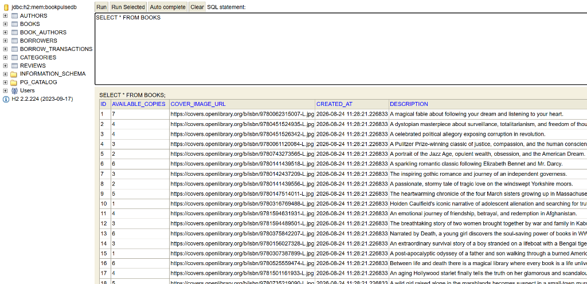

#### Categories Table (`SELECT * FROM CATEGORIES;`)
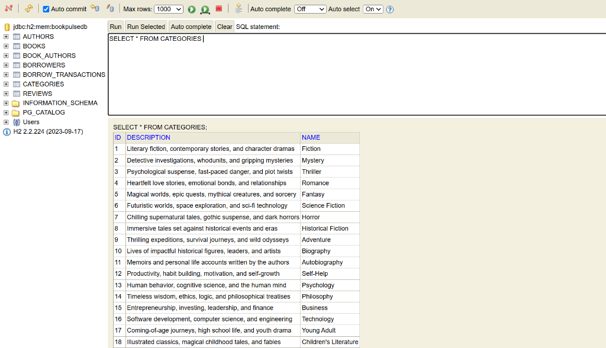

#### Authors Table (`SELECT * FROM AUTHORS;`)
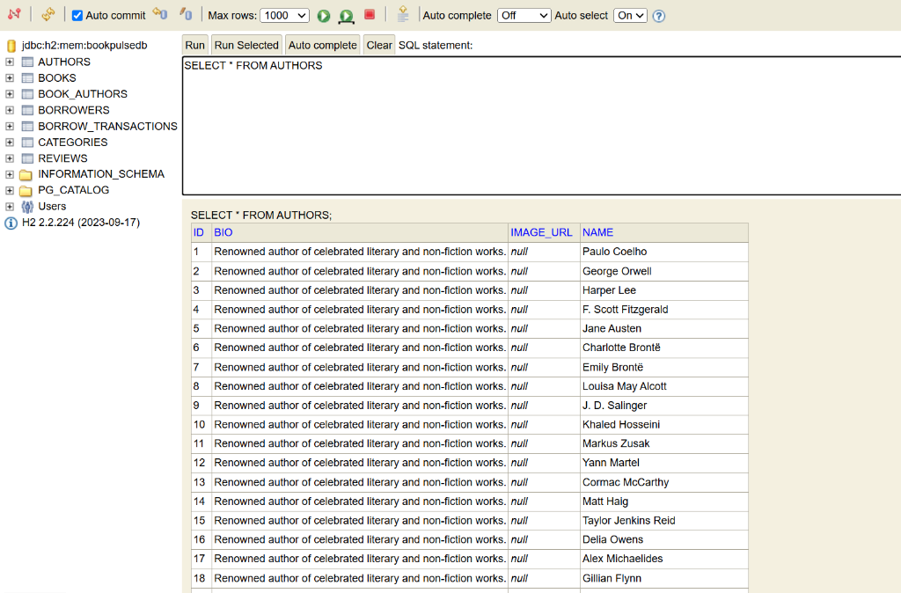

#### Borrowers Table (`SELECT * FROM BORROWERS;`)
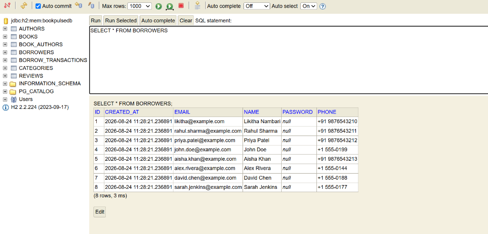

#### Borrow Transactions Table (`SELECT * FROM BORROW_TRANSACTIONS;`)
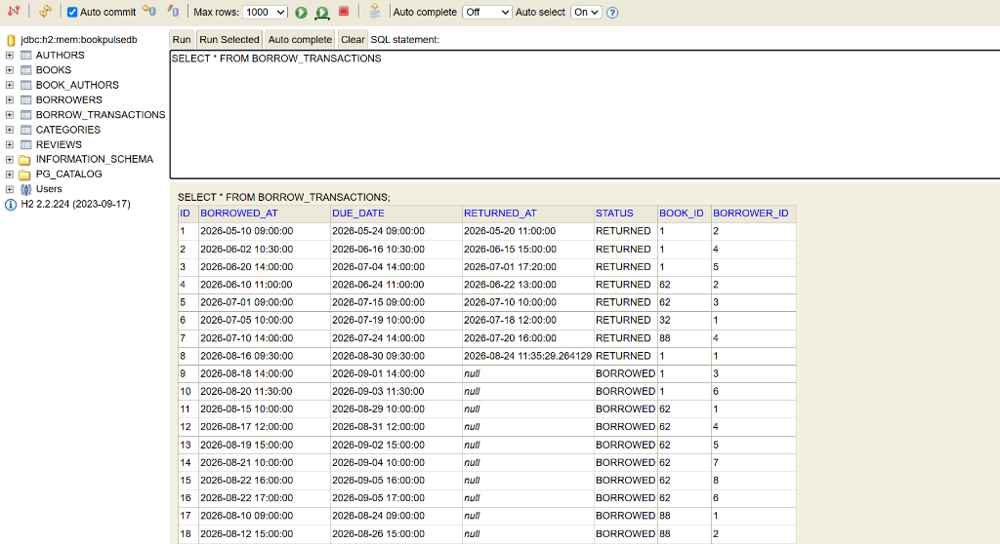

#### Reader Reviews Table (`SELECT * FROM REVIEWS;`)
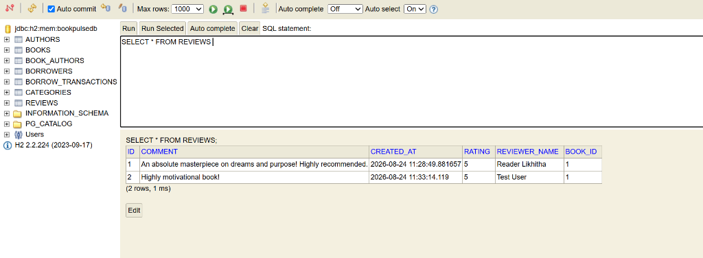

---

### 3. Solutions to Mandatory SQL Tasks

#### Task 1: Find all available books
```sql
SELECT id, title, isbn, available_copies, total_copies
FROM books
WHERE available_copies > 0
ORDER BY title ASC;
```

#### Task 2: Find books by author
```sql
SELECT b.id, b.title, b.isbn, a.name AS author_name
FROM books b
JOIN book_authors ba ON b.id = ba.book_id
JOIN authors a ON ba.author_id = a.id
WHERE a.id = 1; -- Example: Paulo Coelho
```

#### Task 3: Count books by category
```sql
SELECT c.name AS category_name, COUNT(b.id) AS book_count
FROM categories c
LEFT JOIN books b ON c.id = b.category_id
GROUP BY c.id, c.name
ORDER BY book_count DESC;
```

#### Task 4: Find currently borrowed books
```sql
SELECT bt.id AS transaction_id, b.title, br.name AS borrower_name, bt.borrowed_at, bt.due_date, bt.status
FROM borrow_transactions bt
JOIN books b ON bt.book_id = b.id
JOIN borrowers br ON bt.borrower_id = br.id
WHERE bt.status IN ('BORROWED', 'OVERDUE')
ORDER BY bt.due_date ASC;
```

#### Task 5: Find the most borrowed book
```sql
SELECT b.id, b.title, COUNT(bt.id) AS lifetime_borrows
FROM books b
JOIN borrow_transactions bt ON b.id = bt.book_id
GROUP BY b.id, b.title
ORDER BY lifetime_borrows DESC
LIMIT 1;
```

---

## Download, Setup & Run Guide

### Prerequisites
* **Java Development Kit (JDK)**: Version 17 or higher
* **Apache Maven**: Version 3.8+
* **Git**: Installed on your operating system

---

### Installation & Execution in 3 Steps

#### 1. Clone the Repository:
```bash
git clone https://github.com/likithamohana/bookbasket-library-platform.git
cd bookbasket-library-platform
```

#### 2. Build the Application:
```bash
mvn clean package
```

#### 3. Run the Spring Boot Server:
```bash
mvn spring-boot:run
```

The application will start immediately on port **8080**:
* **Web Application**: http://localhost:8080
* **H2 Database Console**: http://localhost:8080/h2-console

---

### Database Credentials & Web Console Login

To inspect and run SQL queries in the live database via your browser:

1. Navigate to **http://localhost:8080/h2-console**
2. Enter the connection settings:

| Field | Configuration Value |
| :--- | :--- |
| **Driver Class** | `org.h2.Driver` |
| **JDBC URL** | `jdbc:h2:mem:bookbasketdb` |
| **User Name** | `sa` |
| **Password** | *(leave blank / empty)* |

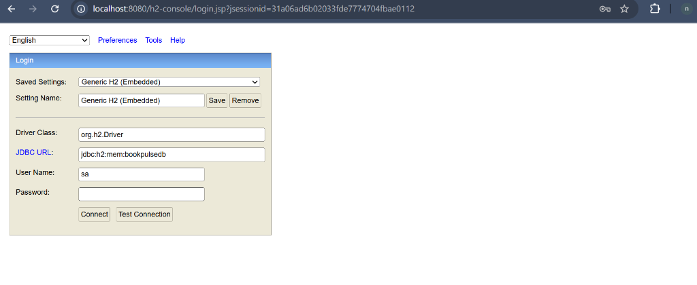

3. Click **Connect** to query any table directly.

---

## Testing & Quality Assurance

The application includes an automated test suite of **64 JUnit 5 unit and integration tests** verifying:

* **BookService & BookController Tests**: Create, read, update, delete, category association, and author linking.
* **BorrowService & BorrowController Tests**: Copy decrement arithmetic, zero-availability exception handling, loan duration calculation, and inventory restoration upon return.
* **BorrowerService & BorrowerController Tests**: Reader registration, account switching, unique email checks, and loan history tracking.
* **CategoryService & CategoryController Tests**: Retrieval of 20 categories, category validation, and book-by-category grouping.
* **AuthorService & AuthorController Tests**: Author registration, bio persistence, author portrait linking, and books-by-author filtering.
* **RecommendationService & RecommendationController Tests**: Natural-language Sky AI interest keyword extraction, scoring, and book matching.
* **AnalyticsService & AnalyticsController Tests**: KPI aggregation (total titles, available copies, active checkouts, registered readers), most-borrowed book calculation, and category percentage breakdown.
* **GlobalExceptionHandler Tests**: Standardized JSON error response formatting for missing entities, insufficient stock, invalid operations, and validation errors.

### Test Execution Command:
```bash
mvn test
```

### Terminal Verification Proof (64 of 64 Tests Passing):

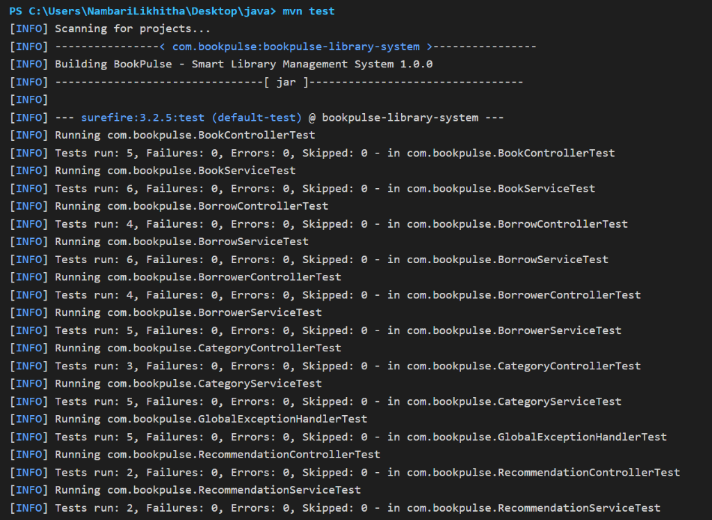
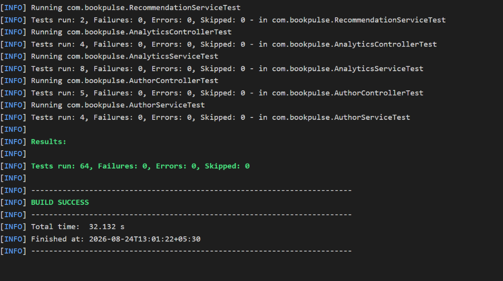

## Project Structure

```
bookbasket-library-platform/
├── src/
│   ├── main/
│   │   ├── java/com/bookpulse/
│   │   │   ├── BookPulseApplication.java       # Spring Boot application entry point
│   │   │   ├── controller/                     # REST API Controllers (Books, Authors, Borrow, Reviews, Analytics)
│   │   │   ├── service/                        # Business logic, inventory arithmetic, & recommendations
│   │   │   ├── repository/                     # Spring Data JPA Repository interfaces
│   │   │   ├── entity/                         # Hibernate JPA database entities (Book, Author, Borrower, Review)
│   │   │   ├── dto/                            # Request and Response Data Transfer Objects
│   │   │   ├── exception/                      # Global exception handler and custom exceptions
│   │   │   └── util/                           # Constants and helper utilities
│   │   └── resources/
│   │       ├── static/                         # Single Page Application (index.html, app.js, styles.css)
│   │       ├── application.properties          # H2 in-memory database and server configuration
│   │       ├── application-postgres.properties    # Optional PostgreSQL configuration
│   │       └── data.sql                        # Seed data for 20 categories, books, authors, & loans
│   └── test/java/com/bookpulse/                # 64 JUnit 5 unit and integration test suite
├── database/
│   └── schema.sql                              # Full DDL database schema definitions
├── docs/
│   └── screenshots/                            # Application and database query verification screenshots
├── pom.xml                                     # Maven dependencies and build configuration
└── README.md                                   # Comprehensive project documentation
```

---

**Author:** Likitha

